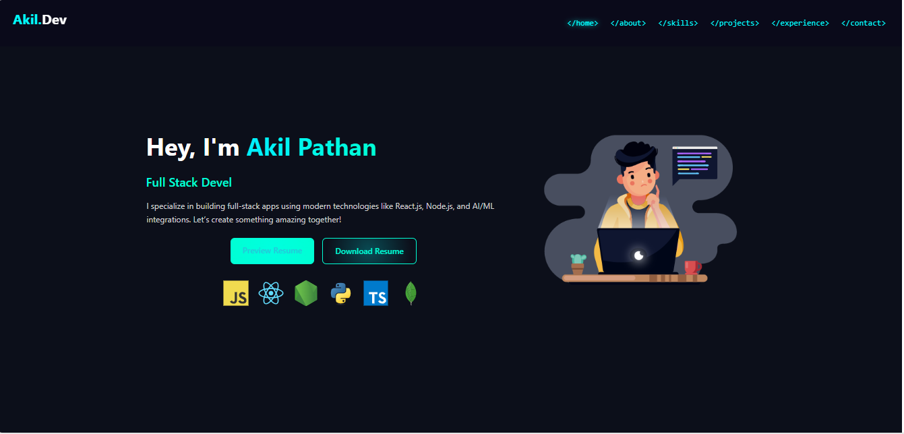
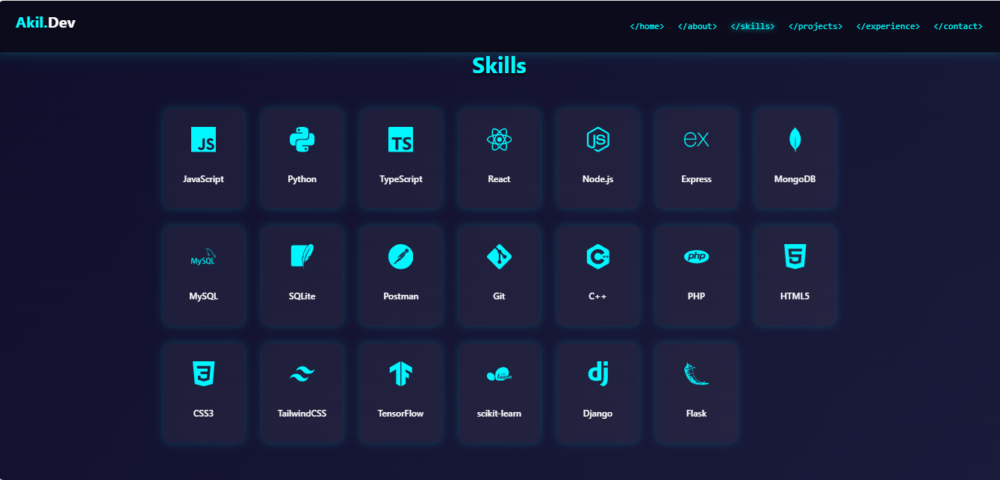
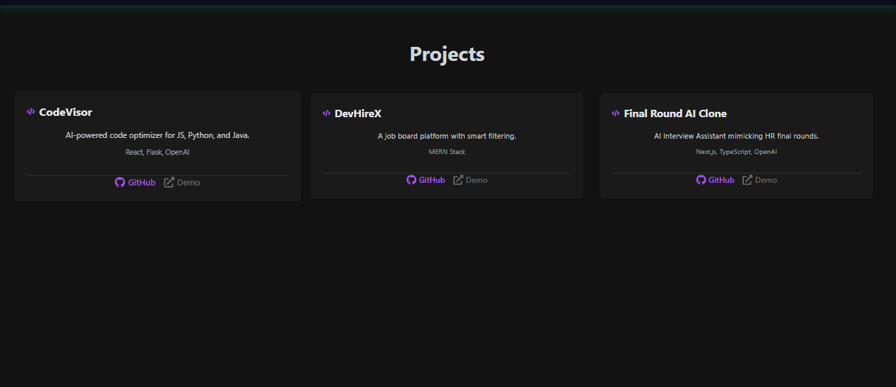
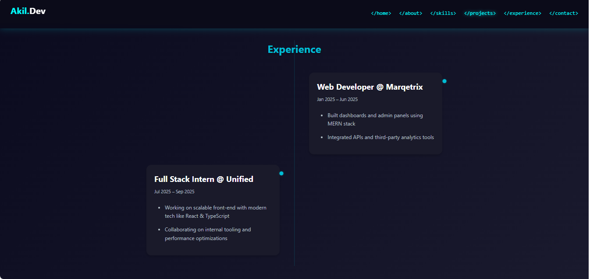
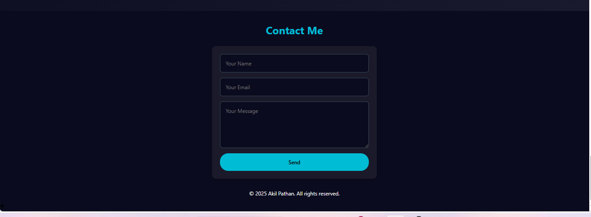

### ✅ `README.md` — *Akil Pathan's Developer Portfolio*

```markdown
# 💻 Akil Pathan — Full Stack Developer Portfolio 🚀

A modern, fully animated, coding-themed developer portfolio built with **React**, **TypeScript**, **Framer Motion**, **Lottie**, and more. Showcases projects, skills, experience, and includes a resume preview + download feature. Designed for FullStack + AI developers.

---

## 📌 Tech Stack

- ⚛️ React.js + TypeScript
- 💨 TailwindCSS (optional custom CSS used)
- 🎨 Framer Motion (animations)
- 🔤 React-Type-Animation (typing effect)
- 🧠 Lottie Animations (`coder.json`)
- 📦 Devicon CDN for tech stack icons
- 📤 EmailJS (Contact — coming soon or optional)
- 📃 Resume Preview + Download
- 🌙 Dark Theme | Responsive UI | Scroll Animations

---

## 🔥 Features

- 🚀 Coding-themed hero section with animated Lottie dev model
- 🧠 Typed role animation: `FullStack | MEAN | MERN | AI`
- 🛠️ Tech icons auto-loaded from Devicon CDN
- ✨ Hover effects, glow buttons, staggered animations
- 📄 Resume preview in a new tab + animated download button
- 📱 Fully responsive design (mobile-first)
- 🎯 SEO-friendly structure
- 🎥 3D-ready layout (Three.js support possible)

---

## 📂 Folder Structure

```

portfolio-akil/
├── public/
│   └── Akil\_\_Resume (1).pdf       # Resume PDF
├── src/
│   ├── assets/
│   │   └── coder.json             # Lottie animation JSON
│   ├── components/
│   │   └── Home/
│   │       ├── Home.tsx          # Hero section with animations
│   │       └── Home.module.css   # Custom styling
│   └── App.tsx                   # Root app layout
├── package.json
└── README.md                     # This file

````

---

## 🛠️ Installation & Setup

```bash
# Clone the repository
git clone https://github.com/your-username/portfolio-akil.git
cd portfolio-akil

# Install dependencies
npm install

# Start the development server
npm run dev
````

> Make sure you have Node.js ≥ 18 and npm installed.

---

## 🖼️ Resume Setup

1. Replace `public/Akil__Resume (1).pdf` with your latest resume.
2. Ensure it's named **exactly** as:

   ```
   Akil__Resume (1).pdf
   ```

---

## ⚙️ Customization

* Update your **Name / Roles / About** in `Home.tsx`
* Change your **tech stack icons** in the `techIcons` array
* Modify Lottie animation in `src/assets/coder.json`

---

## 🧑‍💻 Author

**Akil Pathan**
Full Stack Developer (MEAN | MERN | AI)
📍 Mumbai | 🌍 Remote Friendly
📧 [mulaniakil154@gmail.com](mailto:mulaniakil154@gmail.com)

---

## 💬 Acknowledgements

* [React.js](https://reactjs.org)
* [Framer Motion](https://www.framer.com/motion/)
* [LottieFiles](https://lottiefiles.com/)
* [Devicon Icons](https://devicon.dev/)
* [EmailJS](https://www.emailjs.com/) *(optional contact)*

---

## 📸 Preview






---

## 📝 License

This project is for personal and showcase use. Do not resell or republish without permission.

```

---

```
